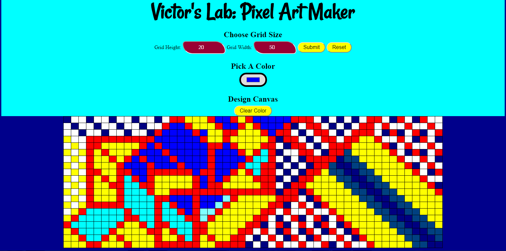

# Pixel Art Project

## Table of Contents

* [Instructions](#instructions)
* [Contributing](#contributing)
* [Try Yourself](#testing)
* [Veiw Example](#veiw)

## Instructions

To get started, open `designs.js` and start building out the app's functionality.

For specific, detailed instructions, look at the project instructions in the [Udacity Classroom](https://classroom.udacity.com/me).

## Contributing

This repository is the starter code for _all_ Udacity students. Therefore, we most likely will not accept pull requests.

## Testing

This is part of my ALCwithGoogle project work under udacity tutelage. I am extremely grateful and happy to present my project. **click** [here](https://vipascal.github.io/udacity-assignment--Pixel-Art-Maker/).

## Veiw

There is an art work by me I caption **IMPRESSION**. it is flashy and leaves an impression
.

